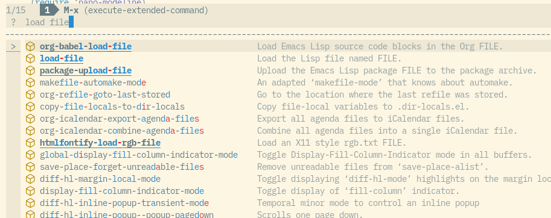
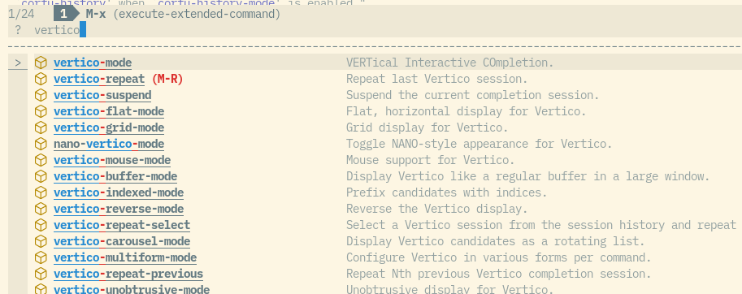
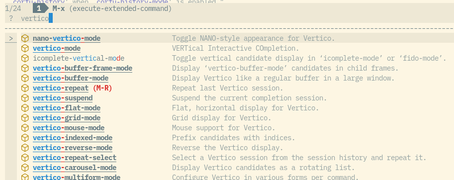
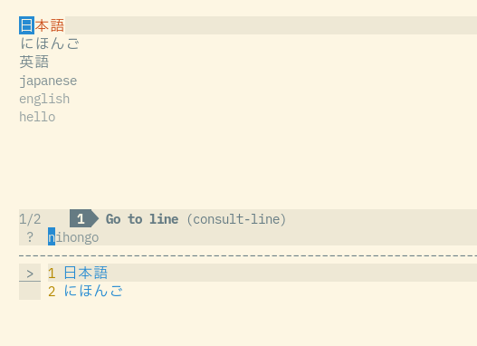

* flex-x

~flex-x~ is an Emacs completion style built on the built-in ~flex~
completion style.

* Features

- Space-separated AND filtering.
- Sort by minibuffer history, then flex match quality.
- Sort by Corfu history outside the minibuffer when ~corfu-history-mode~ is
  active.
- Highlight matches with standard completion faces, and highlight strong
  literal or word-prefix-sequence matches as a whole with ~flex-x-highlight~.
- Add extra matchers or regexp expanders for non-ASCII candidates, for example
  migemo or pyim.

* Screenshots
:PROPERTIES:
:ID:       bc64ca3a-d248-4608-be1e-a2e45bc9af60
:END:

~flex-x~ keeps the standard completion UI while adding AND-style filtering,
match highlighting, and optional extra matching for non-ASCII candidates.

#+caption: Space-separated terms filter candidates with AND, while strong matches are emphasized above looser flex matches.

#+caption: Before selecting ~nano-vertico-mode~, flex match quality places it below stronger matches.

#+caption: On the next invocation, completion history promotes the previously selected ~nano-vertico-mode~ candidate.

#+caption: With migemo configured as an extra regexp expander, ASCII input can match Japanese candidates.

* Setup

~flex-x~ is available from [[https://melpa.org/#/flex-x][MELPA]].  After enabling the MELPA
package archive, install and configure it with ~use-package~:

#+begin_src emacs-lisp
  (use-package flex-x
    :ensure t
    :config
    (setopt completion-styles '(flex-x basic)))
#+end_src

Some completion categories have built-in ~completion-category-overrides~
which can prepend or replace styles for that category. If you want
~flex-x~ to be preferred for those categories too, configure category
overrides explicitly:

#+begin_src emacs-lisp
  (setopt completion-category-overrides
          '((buffer (styles . (flex-x basic substring)))
            (project-file (styles . (flex-x substring)))))
#+end_src

For migemo-style matching, pass ~migemo-get-pattern~ directly:

#+begin_src emacs-lisp
  (with-eval-after-load 'migemo
    (setq flex-x-extra-pattern-function #'migemo-get-pattern))
#+end_src

For pyim-style matching:

#+begin_src emacs-lisp
  (with-eval-after-load 'pyim
    (require 'pyim-cregexp-utils nil t)
    (setq flex-x-extra-pattern-function #'pyim-cregexp-build))
#+end_src

By default, extra matching is called only for candidates containing
non-ASCII characters. Customize ~flex-x-extra-match-nonascii-only~ if
you want it to run for every candidate.

Extra matching scans up to ~flex-x-extra-match-candidate-limit~
raw candidates for the current completion prefix. The default limit is
~5000~; when it is exceeded, flex-x stops predicate-driven enumeration
and skips the extra matching pass. Set it to nil if you want migemo or
pyim expansion to scan every candidate even in very large completion
tables. Ignored filename extensions are filtered after extra matching,
so an ignored file remains available when it is the only match.

With Corfu, enable ~corfu-history-mode~ to sort flex-x candidates by the
recently selected Corfu candidates before flex match quality:

#+begin_src emacs-lisp
  (with-eval-after-load 'corfu
    (corfu-history-mode 1))
#+end_src

Candidates are highlighted as a whole with ~flex-x-highlight~ when every
space-separated search term either occurs contiguously anywhere in the
candidate or matches a concatenation of prefixes from consecutive words.
Words are separated by punctuation or whitespace. Thus ~load~ highlights
~org-reload~, while ~loadfile~ and ~lofile~ highlight ~load-file~ and
~org-babel-load-file~. Non-contiguous matches within a word, such as ~agt~ in
~agent-shell~, keep only the standard matching-character faces.

* Regexp Expander

~flex-x-extra-pattern-function~ can be nil, one function, or a list of
functions. Each function receives a search term and should return a
regexp string or nil.

Examples:

#+begin_src emacs-lisp
  (setq flex-x-extra-pattern-function #'migemo-get-pattern)

  (setq flex-x-extra-pattern-function
        '(migemo-get-pattern pyim-cregexp-build))
#+end_src

* Custom Matcher Protocol

For lower-level control, use ~flex-x-extra-match-functions~.

Each function in ~flex-x-extra-match-functions~ receives ~(TERM
CANDIDATE)~.

It can return:

- ~nil~: no match.
- ~t~: match with ~flex-x-extra-match-score~.
- a number: match with that score.
- a plist: ~(:score SCORE :ranges ((BEG . END) ...))~.

~ranges~ are optional candidate character ranges highlighted with
~completions-common-part~. Matchers that signal an error are ignored so
that one broken matcher does not abort completion.

* Development

~FEATURES.md~ defines the package behavior boundary.

#+begin_src sh
  make test
  make compile
  make check
#+end_src
